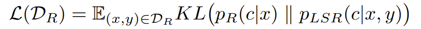

# Literature Review on RAG(Retrieval Augmented Generation) for Custom Domains
Hi! In the course of a project at my university, we were trying to customize our LLM to be good at pen testing. And we wanted to start off with RAGs since it's the cheapest way to customize your LLMs. We found some issues when working with RAGs so I wanted to make a full exploration of the limitations and the current state of the art of RAGs for custom domains.
## What are RAGs?
RAGs were initially introduced in "Retrieval-Augmented Generation for Knowledge-Intensive NLP Tasks" by Meta AI, University College London, and NYU.

The basic ideas of RAGs are very simple. You first encode all the text chunks in your dataset to vectors using say one of the models [here](https://huggingface.co/spaces/mteb/leaderboard). Then, you encode your prompt using the same model. So, when you want to give the model extra context for your question to help it answer, this acts like a Google search by finding the most similar text chunks in the dataset to your question. The ideal scenario now is that the retrieved text contains the answer or helps tremendously in answering your question and thus the LLM can just work on writing that answer.

Now, let us look into the paper.

## 1. Retrieval-Augmented Generation for Knowledge-Intensive NLP Tasks
The main reason RAGs were introduced was while LLMs have an incredible capacity for knowledge they already know, they don't have an easy way to incorporate new knowledge and adapt to it. In this paper, unlike how RAGs are done now, they focus on doing RAG end to end. The idea is during training, the retriever that encodes everything and the LLM to learn at the same time!

This model has 2 parts. The first part is the retriever $p_n(z\mid x)$ which given query x, text, and parameters n, returns z which is the top k best matches. The second part is the LLM which is defined as $p_\theta(y_i \mid x, z, y_{1:i-1})$ where $y_i$ is the current token being predicted, and $y_{1:i-1}$ is the text generated up to this point. So we can read this as predicting the next token given the prompt, retrieved information, and the text generated up to the token.

Now the paper introduced 2 generation methods which while interesting I'll skip for now since I don't think is quite important for discussing the results of this paper.

### 1.1. Retriever
The retriever is something called a DPR and is also the currently best-performing retrieval architecture on the MTEB leaderboard. The general idea is as follows. You have BERT which is one of the most famously good models in NLP. Now, the paper introduces a document encoder and a query encoder which are both based on BERT. The idea is for the document encoder, we keep frozen if not we need to run this document encoder with the updated parameters over the entire dataset every training set. Thus we only unfreeze the query encoder so that we can get the query to be better at matching to the documents we want. Then, the documents with the highest dot product once encoded are regarded as the most similar documents.
### 1.2. LLM/Generator
The LLM used was a model called BART which was made by Facebook.

I'm not too familiar with this model but it seems like the idea is you mask out some tokens and have the model generate those tokens a bit like masked image modeling. And so you can use this by masking out all the tokens after the prompt and gradually denoising. I am very curious if this is better than just LLMs/if this is scalable which I'll put here if I figure it out.
### 1.3. Dataset
The dataset used was a dataset called the squad dataset by Stanford found [here](https://rajpurkar.github.io/SQuAD-explorer/). This consists of questions from crowd workers and the answer as a Wikipedia passage. So overall, it's a question-answer dataset on Wikipedia! So the training objective for this paper is to answer a given question in a Wikipedia fashion.
### 1.4. Results
The overall result was that RAG did boost the model's capability. They measured this based on, in one metric, how many times the answer was an exact match. So we are dealing with very short answers here. This makes sense since the tests were done on datasets like Jeopardy and open domain question answering which the LLM was provided with answers from retrieval. Another more interesting finding was doing end-to-end with the retriever turned out to be computationally expensive and also not worth it. So this is the reason for RAG we just go ahead and just plug a random pre-trained retriever in and not one specific for each language model!

However, one important part to note is that when I tried to do retrieval on web scrapes of pen tests of a dataset using RAGs, the retrieved top k results weren't too helpful. In that, if you do retrieval on a prompt, the top k returned results rarely contained any useful information to help the LLM answer. I know this because the answers with retrieval usually did worse than those without. Does this contradict the above research? The answer is no. The above research was research on doing retrieval and generation on a Wikipedia dataset. This is not a specific domain dataset so it does not require tuning. However, if we want to retrieve from a specialized domain, we might want to tune our retriever! This was the idea behind "Improving the Domain Adaptation of Retrieval Augmented Generation (RAG) Models for Open Domain Question Answering"

## 2. Improving the Domain Adaptation of Retrieval Augmented Generation (RAG) Models for Open Domain Question Answering

For an in-depth explanation of this paper, I recommend checking out [this awesome medium post](https://shamanesiri.medium.com/how-to-finetune-the-entire-rag-architecture-including-dpr-retriever-4b4385322552) by the authors. This paper was originally a very short 4-page paper. This is a longer version and the main contribution is this: if you also train the retriever, both the document and query encoder, in this end-to-end training, you'll be able to adapt to a certain domain.

Now, you might be wondering. How is this even possible? The whole reason why the original paper didn't do this was because it was computationally unfeasible. And the pretty clever solution was to just have free GPUs/threads have their entire job be reindexing the dataset every N steps. And the main training just updates the parameters!
### 2.1. Reconstruction to Force Domain Adaptation
As an additional signal for the above training, they made one objective input -> encode with query encoder -> get K nearest neighbors(knn) -> use knn to reconstruct input. This is a clever way to force the retrieved passages to be actually similar to the input thus forcing domain adaptation. In practice, in one dataset, this paper uses the abstract of a research paper as the input to be reconstructed from the rest of the research paper which makes perfect sense.
### 2.2. Question Answering Synthetic data
This feels a bit like the current methodologies of making instruct datasets but we want to make a QA dataset like the above for training. For this, they followed the paper "End-to-End Synthetic Data Generation for Domain Adaptation of Question Answering Systems" which was a collaboration between Amazon and Google. I found a checkpoint [here](https://huggingface.co/lmqg/bart-large-squad-qag?text=Beyonce+further+expanded+her+acting+career%2C+starring+as+blues+singer+Etta+James+in+the+2008+musical+biopic%2C+Cadillac+Records.) which seems to have an example model. This seems very suited for making questions and answers on very short passages in a very simple way. This was pretty interesting to me since a lot of self-instruct datasets, rely on chat GPT, etc to generate instructions/questions and answers for help with training exactly like this. But that tends to be way more expensive. So this might be a good alternative if scaled up to around 1000 words or so.
### 2.3. Results
Doing all this did seem to significantly improve performance. However, I think it's important to note that this research, while very interesting has not reduced the computation needed for training. It just removed the need to stop training if you have multiple GPUs. Also, this was research on a BART model which has only 400M params. I don't think this is practical if we have even a 7b LLM with Lora to train this on a single GPU. Thus while interesting, I think only the reconstruction idea and question-answering part can be used for large-scale training unless there is some new optimization that can be done.
But what if we only tune the retriever to be in the domain? Then can we avoid this issue of too much computation? The authors also investigated this.
### 2.4. Finetuning only the retriever
The encoder/DPR is trained with a lot of positive samples and hard negatives. The idea is to have the dot product be highest for similar passages and as close to 0 as possible for very different passages. Now, how do we finetune our retriever in this setting? Now we have already generated a lot of question-answer pairs. What we want is given a question to retrieve an answer. So we have our positive pairs! Now what about hard negatives? For this apparently, the original authors of DPR used a search strategy called [BM-25 lexical matching search](https://en.wikipedia.org/wiki/Okapi_BM25) which seems like an algorithm developed for search engines. The main idea is to use this algorithm to find passages that are least likely to contain the answer to the question. So now we can train only the DPR model!
The results were interesting. Doing this finetuning helps as the initial checkpoint and compared to vanilla results however it didn't perform as well as having the encoder trained end to end like above. So if you are interested in cheap training, this is a strategy but not a conclusive one. For the full performance gains, the full training has to be done.

Now has there been an attempt to make this into a large model? The closest I can find, also from Facebook, but with different authors from the original RAG paper, was "RA-DIT: Retrieval-Augmented Dual Instruction Tuning" where they have trained a 65B parameter model using this technique.
## 3. RA-DIT: Retrieval-Augmented Dual Instruction Tuning

The idea for this paper is pretty similar to the last one. The authors wanted to do 2 things
1. enhancing the LLM’s capability to incorporate retrieved knowledge. This phase is called $p_{LM}$
2. refining the retrieval component to return more relevant content. This phase is called $p_R$
and training separately. Thus one important dis-similarity is that this research is not end-to-end
### 3.1. Overall objective

The final output is like the above. What this says in plain English is the probability of output given the input prompt and retrieved text chunks is the sum of probabilities of getting the output given you concatenate the retrieved context with the input times the probability of getting that context given the input.

One interesting part to note is that $p_R$ tells us how much we should prioritize each context. Also, this is a bit more expensive than usual LLMs because we need to do a forward pass for each context separately. I am pretty curious if this has that much better results.
### 3.2. Finetuning LM
Now in the last presentation/article where we covered Zephyr [here](https://isamu-website.medium.com/understanding-zephyr-12c5b9d3b822) we talked a bit about supervised finetuning and how we make an instruction dataset. This basically means making question-and-answer pairs so that we can finetune the LLM so that given a question/instruction, it outputs the answer!
Now, here the idea is slightly altered. What we do is given a question and answer pair $(x_i, y_i)$ we retrieve k nearest neighbors, $c_j$s, and then we concatenate each of these retrieved contexts to x. Then, we want our LLM to be able to utilize these contexts to the best of its ability so then we train it like so

The paper raised a very good point here. By having the model generate the correct output regardless of whether the retrieved information is correct, the model should learn to ignore incorrect information which is exactly what we want.
### 3.3. Finetuning Retriever
This technique was very interesting to me. What the authors did was first say we have the question and we also have the answer in the form $(x, y)$. Now, can we use $p_LM$ to tell us how useful our context was to getting the answer? The overall math formulation is like the one below

The C' is an approximation of the whole context C by just retrieving the K most promising ones. The overall idea is let's find the context, within the retrieved contexts that helps answer the question the most!
Now, one difference for the retriever in the real world vs this scenario is that we do not know the answer to x normally. For this, the authors do a second step like the one below

where they make $p_R$ try their best to match the probability distribution of $p_{LSR}$ given just the input x. 
Now, you might be wondering, for the retriever we retrieve based on dot product. How do we even get $p_R(c \mid x)$. The idea is to just increase the probability when you have a high-dot product like so!

where s is the dot product

For here one important distinction to the previous paper is the authors only do this on the query encoder. The full training of both the query encoder and the document encoder is out of the scope of this paper.
### 3.4. Results
The final results are as follows: for the Open-LLM benchmark, this method outperformed the baseline method across pretty much all benchmarks. I think the 2 main parts missing in this research are studying how this helps in certain domains, which I was most curious about, and also attempting to tune the document encoder too although it might be impractical in practice. I feel like this work had more potential than the previous one for working with large language models by not making the entire thing end-to-end. So I feel like you can do the reindexing more easily in this formulation but we will see!

# Conclusion
Overall that's it for domain adaptation for LLMs let me know if anyone has any other papers that might help with this/anything that you think I missed!