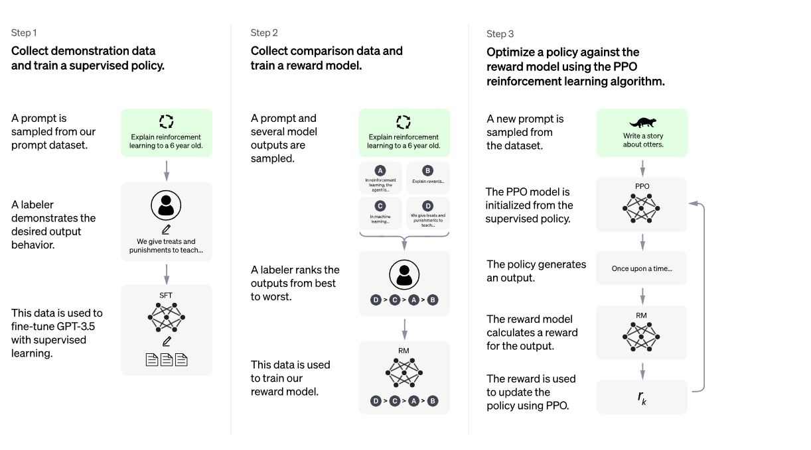
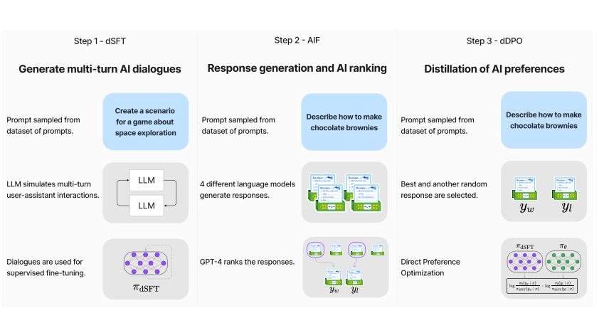
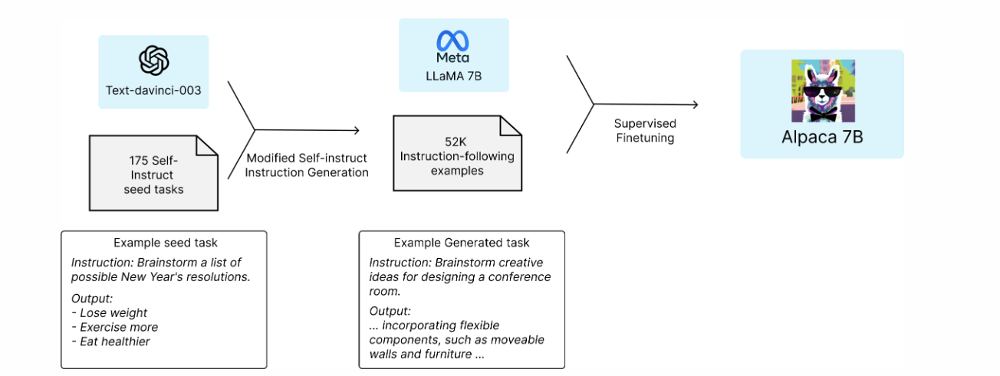
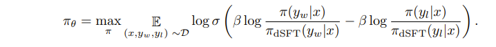

# Understanding Zephyr
Hi! Welcome to my post on Zephyr. Zephyr, a model made by Huggingface, when you check here, https://tatsu-lab.github.io/alpaca_eval/ and https://huggingface.co/spaces/lmsys/chatbot-arena-leaderboard seems to have a pretty good evaluation vs GPT 4 even outperforming GPT 3.5(ChatGPT) on Alpaca leaderboard as just a 7b model. I tried a bit of tests on my end with https://huggingface.co/spaces/HuggingFaceH4/zephyr-chat for a personal project and it does seem to be very good at following user intent. However, some slight drawbacks of this model that I noticed are that, probably due to it only being a 7b model, it has trouble with logic as can be seen by the openLLM leaderboard https://huggingface.co/spaces/HuggingFaceH4/open_llm_leaderboard. Currently, I don't think the full model is listed in the open llm leaderboard but in the paper, it's claimed that it did the best out of all 7b models and it did outperform some 40B models which is pretty impressive. But it's not good with logic as larger models like 33b or 70b parameter models and Chat GPT for that matter which makes sense. So overall, this model is good for conversations but not logic/knowledge per se and that is exactly what this paper is going for.
## LLM evaluation(Optional)
Now, here I think it is important for us to know how exactly LLMs are evaluated. There are mainly 2 ways LLMs are evaluated
1. Evaluate vs GPT-4

This is pretty simple. You give GPT 4 a prompt in a format like below(in the case of alpaca)
```
<|im_start|>system
You are a helpful assistant, who ranks models by the quality of their answers.
<|im_end|>
<|im_start|>user
I want you to create a leaderboard of different large-language models. To do so, I will give you the instructions (prompts) given to the models, and the responses of two models. Please rank the models based on which responses would be preferred by humans. All inputs and outputs should be Python dictionaries.

Here is the prompt:
{
    "instruction": """{instruction}""",
}

Here are the outputs of the models:
[
    {
        "model": "model_1",
        "answer": """{output_1}"""
    },
    {
        "model": "model_2",
        "answer": """{output_2}"""
    }
]

Now please rank the models by the quality of their answers, so that the model with rank 1 has the best output. Then return a list of the model names and ranks, i.e., produce the following output:
[
    {'model': <model-name>, 'rank': <model-rank>},
    {'model': <model-name>, 'rank': <model-rank>}
]

Your response must be a valid Python dictionary and should contain nothing else because we will directly execute it in Python. Please provide the ranking that the majority of humans would give.
<|im_end|>
```
so essentially you get the output and directly put it into code to say which model did better. For MTBench it is a pretty similar approach.

The main drawback of this approach is that you are using GPT 4 as the evaluator. In that, it's a closed source model that, while impressive, we don't know if its capabilities are constant. So with this eval, we are pretty much depending on Open AI to keep gpt 4 exactly the same. And there has been research that this is not much the case.

The other way LLMs are evaluated is

2. Looking at the most likely next token

The idea behind this is pretty much all in this Eleutherharness repository and it is what the OpenLLM leaderboard is based on https://github.com/EleutherAI/lm-evaluation-harness.

The main idea is this: you give the AI a problem with 4 choices, SAT style, and as it whether a, b, c, or d is the correct answer. Then, you just find which of the tokens a, b, c, or, d has the highest probability of getting chosen! This is a pretty interesting approach but it's slightly flawed in that it assumes that the LLMs will start off with giving an answer or at least consider starting to give an answer which is not always true as you might notice from talking to chat GPT.
Another reason this is a bit flawed is that it doesn't allow us to compare vs closed source models which I did notice a person on a podcast mentioning. The main reason is that we do not know what the closed-sourced model's next most likely token is.

So now, it makes sense that if you want a model that follows human intention, you will want to prioritize evaluating vs GPT-4 as it can evaluate text in its totality. But if you want to evaluate logic, the most likely next token approach is better.

## The 3 stages of Zephyr
To understand how Zephyr was made, we need to look at 3 training procedures that make up Zephyr. These are
i. Supervised finetuning
ii. Feedback
iii. Reinforcement learning


This is very close to how Open AI trained their Chat GPT as can be seen by their diagram in comparison to Chat GPT's.

However, this paper, and the papers leading up to it eliminated the need for a human in the loop which did make the entire thing a lot cheaper. Although, like most LLM papers, it relies on GPT-4 for training.


first of all, let us look at supervised finetuning

### How to finetune LLMs

Now, even when we say we want to finetune an LLM, I think the first question we have is how exactly we are supposed to do that. One idea is to have a dataset we like which is a bunch of text and just finetune our large language model on that so that the next token it predicts is like the text in the dataset.

However, I think you will quickly notice that this pretty much removes all the "chat" aspects of the LLM. What we want is we want to tell our model to do something and for it to do exactly that. So, the next option, which had quite reasonable success, was called Supervised Finetuning(SFT). This was, as far as I know, first popularized in Chat GPT and can be seen in the diagram above under step 1. The idea is you write the instruction to the LLM and the output you want. Then, you make a huge dataset of these instructions and outputs. And then you make the LLM learn the best responses to the instructions. I learned about it from here https://medium.com/mantisnlp/finetuning-an-llm-rlhf-and-alternatives-part-i-2106b95c8087 which is a great blog. Highly recommended.

However, one main issue here is that this requires humans to generate a lot of tasks and outputs and that is very expensive and reliant on humans. So is there a way to reduce human work?

The solution to this is what this paper https://arxiv.org/abs/2212.10560 found and called Self Instruct. The idea is you give a few human-generated inputs and outputs to a powerful LLM like GPT-3.5, and it can generate a lot more examples like the instruction output pair. This does significantly lower reliability and also you are relying on GPT-3.5 for great output but it did lead to quite a bit of gains. For example, this is pretty old news but the Standford alpaca model became pretty powerful just by doing this

Now these methods as a whole are called Supervised Finetuning(SFT). And it is the first part of how Zephyr was trained. In Zephyr, they put a slight spin on how the dataset is generated. Instead of just having the LLM generate random instructions and responses given examples of human-made self instruct classes, the authors decided to
1. Generate a response from one of the seed prompts(we don't have a ground truth prompt)
2. Generate a revised prompt given the original prompt and the generated answer
3. Repeat again but given the generated prompt
Then finally do supervised finetuning on this dataset with the 7b model! I found this approach pretty interesting. It felt a bit like a game of Pictionary in a way. However, one limitation that I think happens here is that this will cause the model to not have much diversity in output. Mainly because it seems like all the tasks in the seed prompts should be reasonably close to the generated prompts.

To resolve this issue, we need to have an intelligent or pseudo-intelligent being in the loop to judge our responses.

### Feedback
When Chat-GPT was first introduced this was one of the pretty interesting parts of the paper! The idea was you have the large language model generate multiple candidates of outputs. Then, you have a human rank them. And finally, you train a small model to learn, given the output of the model, how good the output is. Now, while this works, there is a slight issue in that humans are very expensive. Also, I think there were a couple of papers showing that GPT 4 outperforms crowd-sourced labor and workers of mechanical Turk were just using chat gpt for annotations. So, currently, it seems like the cheaper and better way to do things is to just use GPT-4. This is called AI Feedback(instead of human feedback). The specific task is as follows
1. We have a list of prompts
2. We feed these into some language models like Claude, Falcon, Llama, etc
3. We put these in GPT-4 which scores the responses
4. Interestingly we save the best-performing response as well as the worst-performing response. So we will have the prompt, best response, and worst response triplets.

So interestingly we do not seem to train a model to predict rewards.

Now, this is the final state of reinforcement learning!

### Reinforcement learning
In Chat GPT, the main idea for the final part was given the supervised finetuned model, you have it generate outputs. Then, a model that was trained to figure out how good the output is gives the reward to the supervised finetune model, and based on that reward or lack of reward, it'll learn to generate better output. The reinforcement algorithm used was called PPO and is a pretty standard method for reinforcement learning.

Here, the authors instead used a technique called direct preference optimization which did away with the need for another model to evaluate the output. However, if I understand correctly, they make a copy of the distilled finetuned weights and freeze the distilled finetuned model.

Then, they try to maximize the probability of, given a prompt, generating the winning response, while at the same time minimizing the probability of generating the losing response like so

The reason I think they divide by the distilled finetuned model's probability is just so that initially, the output of the model will be 0. And as training goes on the changes will be small which will be pretty great for the case of neural nets since they are pretty terrible with big values.
Also, the reason they use log here is pretty simple! If you multiply a lot of variables in the loss function, it's like asking for infinite values. But if you change it to logs, it just becomes a bunch of additions and subtractions. Overall highly desirable bounded outputs.

## Results

For the datasets, they used datasets called UltraChat and UltraFeedback. Interestingly even with chat gpt output, for ultra chat, there are grammar errors that need fixing and can provide unhelpful output like "I don't have personal experience."
For ultrafeedback it seems like not much cleaning was needed as GPT-4 was the evaluator. However, they did modify slightly from choosing the best and the worst options to make the reinforcement learning phase a bit harder.
So, one great thing about this method is pretty much all the expensive prompting of GPT-4 is already done and open source.

Some interesting results were that yes it made Zephyr remarkably competent in aligning with user intent. But a bit more surprising result for me was that this training process made it perform better than the original Mistral model on Open LLM leaderboard. My main guess for this is from the DDPO stage since the supervised fine-tuning stage just uses chat gpt/ But interestingly, in their ablation study, for the alpaca evals, the supervised finetuning stage is very crucial in getting good results. For example, just using DDPO gives a win rate of 30% while with supervised finetuning it jumps all the way to 86%!
This doesn't indicate how good the logic is per se but I do wonder where it learned to be better at academics.
One limitation of this research that the author acknowledges is we do not know how good this does with scale which I think we might see from Huggingface in the future!